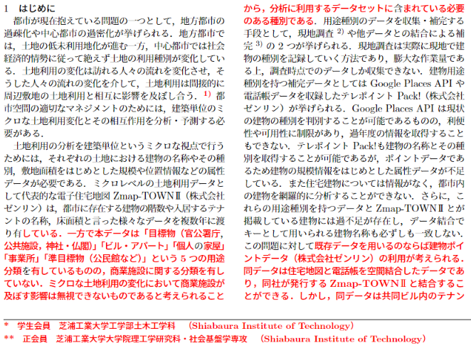

# latex 差分ファイルの作り方

## そんなものいる？

査読付き学会（我々の中で最もよくあるのは都市計画学会）では，１次審査後の査読意見に対して修正を行い，再度審査に提出するといったことがよくあり，その際の添付ファイルとして変更箇所をフィーチャーしたファイルの提出を要求されることがあります．

変更部分をどこかにメモしておいて，自分で１から作成しても良いですが，latexを使っていれば変更部分をフィーチャーしたファイルを一発で作成することができます．

## 出力物

変更によって追加された文言を赤く表示することができる（後述の設定を変更することで削除した文言を併記することもできる）

## 必要なもの
- 変更前のTexファイル（before.texという名前と仮定）
- 変更後のTexファイル（after.texという名前と仮定）
- （TexLiveのインストール）

> TexLiveを入れず，ダイレクトに`latexdiff`コマンドのみを[インストール](https://ctan.org/tex-archive/support/latexdiff/)する方法もある（READMEはLinux，Mac向けに書かれている）

## やり方

1. 「必要なもの」に記載したファイルが格納されているフォルダをカレントディレクトリとするコマンドプロンプトを開く
2. 以下のコマンドを入力する

    `latexdiff -t BOLD before.tex after.tex > diff.tex`

    > もし，「latexdiffがありません」といったメッセージが出力された場合はTexLiveのインストールに問題がある

3. `diff.tex`というファイルが出力されるため，これをOverleafに読み込む
4. `\providecommand{\DIFadd}[1]{{\bf #1}} %DIF PREAMBLE`と書かれた行が上の方にあるため，これを以下のように変更
   
    `\providecommand{\DIFadd}[1]{{\protect\color{red} \bf #1}} %DIF PREAMBLE`
    
5. Overleafの「メニュー」を開き，「主要文書」を`diff.tex`に変更
6. 「リコンパイル」すると差分をフィーチャーしたPDFが表示される

    > 差分のフィーチャーが過剰に入っている場合は，過剰な箇所にある`\DIFaddbegin`, `\DIFadd`, `\DIFaddend`, `\DIFdelbegin`, `\DIFdel`, `\DIFdelend`を削除することで普通の表示に直すことができる

## 注意点
複雑なマクロでラップされた行（都市計画学会のフォーマットでは「タイトル」と「キーワード」）は差分の追跡がされないため，自分でフィーチャーする必要がある

図表は特に体裁が崩れやすいため，確認の上，修正する必要がある

sectionの構成を変えた場合，タイトルが空になったsectionが生成されるため，不要であれば次の行にある`\addtocounter{subsection}{-1}%DIFAUXCMD`とセットで削除する

## 参考
- [**添削者を困らせることのない**修士論文の書き方の研究](https://www.isee.nagoya-u.ac.jp/~okumura/files/MasterThesisTemplate_v2.3.0.pdf)
