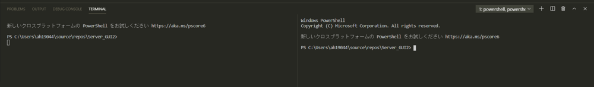
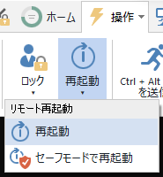

# 目次 <!-- omit in toc -->
- [ログインパスワード](#ログインパスワード)
- [Discordアカウント](#discordアカウント)
- [利用上の注意点](#利用上の注意点)
- [スペック](#スペック)
- [導入済みツール（アプリケーション）](#導入済みツールアプリケーション)
- [導入済みツール（開発）](#導入済みツール開発)
- [Pythonの実行（仮想環境）](#pythonの実行仮想環境)
  - [やり方（初期設定）](#やり方初期設定)
  - [やり方（使い方）](#やり方使い方)
  - [技術的な話](#技術的な話)
- [複数の計算プロセスを並列する方法](#複数の計算プロセスを並列する方法)
  - [役立つ場面](#役立つ場面)
  - [やり方（VSCodeあり）](#やり方vscodeあり)
  - [やり方（VSCodeなし）](#やり方vscodeなし)
  - [技術的な話](#技術的な話-1)
- [遠隔操作](#遠隔操作)
  - [役立つ場面](#役立つ場面-1)
  - [やり方](#やり方)
  - [技術的な話](#技術的な話-2)
- [GPUで機械学習](#gpuで機械学習)
  - [役立つ場面](#役立つ場面-2)
  - [やり方（PyTorch）](#やり方pytorch)
  - [やり方（TensorFlow）](#やり方tensorflow)
  - [技術的な話](#技術的な話-3)


# ログインパスワード
「Oyama_lab」（アカウント名と同じ）


# Discordアカウント
|項目|値|
|:---:|:---|
|メールアドレス|actscape.lab@gmail.com|
|アカウント|ハイスペPC|
|パスワード|OyamaLab|
|生年月日|2000年1月1日|


# 利用上の注意点
このPCは共有の計算リソースとして利用するため、個人の開発をこのPCで行うような独占行為はご遠慮ください。

デスクトップ上にショートカットのある「Repositories」はGitのクローン先フォルダとして用意しています。年度ごとに分けてご利用ください。

デスクトップやダウンロードフォルダに個人的なファイルを放置しないようにしてください（整理整頓を心がけて下さい）

何かにログインする際は原則研究室のアカウントを用い、個人アカウントでのログインはお控えください。

どうしても個人アカウントでのログインを必要とする場合には[プライベートブラウズ](https://support.google.com/chrome/answer/95464?hl=ja&co=GENIE.Platform%3DDesktop)の利用をご検討下さい。

リポジトリへPushするとアカウントが「ActScapeLab」となってしまい、誰が変更を加えたか分からなくなってしまうため、ハイスぺPCから**Pushはしないようにしてください**


# スペック
- `CPU`：AMD Ryzen9 5950X (16Core 32Thread)
- `GPU`：AMD Radeon RX 6900XT
- `RAM`：128GB (3.2GHz)
- `ROM`：2TB＋4TB＋4TB（SSD＋HDD＋HDD）
- OS：Windows Pro 64bit

# 導入済みツール（アプリケーション）
- Slack（Desctopアカウントあり）
- Google Chrome
- TeamViewer（遠隔操作に必要）

# 導入済みツール（開発）
- Visual Studio Code
- Git
- Python 3.8.10
  - **（導入済みの主要パッケージ）**
  - Pandas			1.4.3
  - GeoPandas		0.11.1
  - Numpy			1.23.1
  - NetworkX		2.8.6
  - PyTorch			1.8.0
  - TensorFlow		2.10.0


# Pythonの実行（仮想環境）
共用のPCだと新しく入れたモジュールによって他の誰かが入れたモジュールの依存関係を破壊してしまい，実行不可能なプログラムを作成してしまうことがあります．

そのため，ハイスぺPCではプロジェクトごとに仮想環境を導入し，このような事故が起こらないようにします．


## やり方（初期設定）
1. プロジェクトフォルダを`git clone`などを使って作成する
2. プロジェクトフォルダ内をカレントディレクトリとするコマンドプロンプトを起動する（VSCodeの場合，プロジェクトフォルダを開いたうえで統合ターミナルを開けば，自動的にこの状態になっている）
3. 開いたコマンドプロンプトで`py -3.9 -m venv 適当な分かりやすい固有な名前（アルファベット）`を入力する
   - `-3.9`の部分は作成したいPythonのバージョンによって変える
   - バージョンがそもそもPCに導入されていない場合は，[公式のページ](https://www.python.org/downloads/)からインストーラーを使って導入した後に仮想環境の作成を行う
4. 指定した固有な名前のフォルダがプロジェクト内に作成されたら，`固有な名前/Scripts/Activate.ps1`を入力
5. コマンドプロンプトに`(固有な名前)`といった表示が出てくることを確認する（これで仮想環境の起動は終了）
   - Git管理している場合は，.gitignoreに`固有な名前/`を登録しておくことで，管理対象から除外しておく
   - **仮想環境は非常にサイズが大きいため，絶対にPushしてはいけない**


## やり方（使い方）
1. 必要なモジュールを仮想環境に導入する
   - 普通にpipをたたけば仮想環境にモジュールが導入される
   - PyTorchやTensorFlowを使って機械学習をする場合は，
     1. デスクトップにあるvenvsフォルダのPyTorchフォルダなどにアクセスし，その中にあるrequirements.txtをコピー
     2. プロジェクトフォルダ直下にペースト
     3. 上記で開いたコマンドプロンプトに`pip install -r requirements.txt`と入力してモジュールを導入

    なお，PyTorchを実行する場合はPythonのバージョンは3.6～3.8のいずれかにする必要あり（2022/12/17現在）
    
    このバージョンについては依存モジュールの[公式ページ](https://pypi.org/project/pytorch-directml/)を適宜確認して更新をお願いします
2. VSCodeの右下にある実行するPythonのバージョンを仮想環境のものに変更する
3. いつも通りPythonを実行すれば実行環境を仮想環境にした状態で実行される


## 技術的な話
普段何気なくPythonを実行すると，その実行環境はPC本体の環境になり，どのPythonプログラムを実行するときもその環境でプログラムが実行される

一方で仮想環境を導入すると，PC本体の環境の状態にかかわらず，全く別の（仮想的な）環境で実行ができるため，そのプログラムのためだけのPython環境を作ることができる

ハイスぺPCではプロジェクトごとに仮想環境を立てることで，それぞれのプロジェクトを実行するために必要な環境を独立して用意し，お互いのモジュールの依存などに影響を受けないようにしている

仮想環境を強制するために，ハイスぺPCでは仮想環境なしでpipが実行できないようになっている（環境変数の登録がされていない）


# 複数の計算プロセスを並列する方法
## 役立つ場面
- 卒論の追い込み時期など、複数人でそれぞれプログラムを走らせたい
- 同一のプログラムについて条件を変えたマルチケースで結果を計算したい

## やり方（VSCodeあり）
1. VSCodeを起動する（すでにほかの人が起動中の場合は「Ctrl＋N」で新しいWindowを立ち上げる）
2. 作業環境のフォルダ（リポジトリのルートフォルダなど）をVSCodeにドラッグアンドドロップする
3. 実行したいプログラムを開き、プログラムを実行する
   
   （マルチケースで結果を計算したい場合は、VSCode上の実行画面（ターミナル）を画像のようにゴミ箱マーク左横の画面分割ボタンを押して複数起動し、プログラムをそれぞれのケースに編集した上で実行することで、複数のケースを同時に計算していくことができる）

    


## やり方（VSCodeなし）
1. 実行したいPythonファイルをエクスプローラーで開き、ファイルがあるフォルダのパスをコピーする
2. Win+Rを押し、cmdと入力する
3. コマンドプロンプトが起動したら、`cd コピーしたフォルダパス`と入力してカレントディレクトリを移動する
4. `py 実行したいPythonファイル名`として、プログラムを実行する
   
   （複数起動する場合は起動している個数分コマンドプロンプトが開かれている）


## 技術的な話
どちらのやり方であっても実行速度に影響はない

VSCodeなしの場合、実行するプログラム内に（ファイルの指定やimportにて）相対パスが含まれている場合は実行位置に注意する

機械学習のような計算リソースを大幅に必要とするものを複数同時に起動する場合にはタスクマネージャーを確認し、実行に余裕があるか確認したほうが良い

並列プログラムを実行する場合、CPUコアをすべて利用する設定だと後から実行されたプログラムとリソースが競合してクラッシュする（or 大幅に実行が遅くなる）可能性がある


# 遠隔操作
## 役立つ場面
- 家にいながらハイスペックなPCを操作することができる
- 時間のかかる重い計算処理の様子をその場に張り付いていなくとも確認することができる

## やり方
1. ハイスペPCでTeamViewerを起動し，表示されている「使用中のID」「パスワード」をメモする
2. [TeamViewerを個人のPCにインストールする](https://www.teamviewer.com/ja/)
3. 個人のPCでインストールしたTeamViewerを開き，「リモートコントロール」にメモしたIDを入力する
4. 「接続」をクリックするとパスワードを要求されるため，メモしたパスワードを入力する
5. ハイスペPCのデスクトップ画面が見えれば接続成功

## 技術的な話
ハイスペPC側でTeamViewerを閉じてしまうとIDとパスワードが変わってしまうため，研究室でハイスペPCを触るときに誤ってTeamViewerを閉じてしまわないよう注意する必要がある

遠隔操作になっても画面とマウスポインタ―は研究室側と合わせて１つしかないため，譲り合って利用する（複数人がTeamViewerを通して同時に画面を見ることは可能）

再起動を遠隔で行う場合は，スタートメニューから直接再起動せず，TeamViewerの操作盤から行うようにすると起動した際に自動で再接続するように設定できる



OS非依存で利用することができる（ただし，Macはショートカットキーに若干の違いがある）


# GPUで機械学習
## 役立つ場面
- 機械学習モデルを学習したり推定に利用したりしたいが，個人PCでは時間がかかりすぎる
- 個人PCで初めから環境を構築するといつ実行できるか分からないため，ハイスペPCの環境を利用したい

## やり方（PyTorch）
ハイスペPCではPyTorchの実行はPython3.8で行うことができる

PyTorchでは計算に使用するデバイスを明示してプログラムを記述する必要がある

例えば次のようなプログラムを記述することでGPUでモデルの計算を行うプログラムになる

モデルとモデルに投入する変数をどのデバイスで扱うか明示しておけば，そのデバイスで計算がされる格好である

`pytorchSample.py`
```py
import torch
import torch.nn as nn
import torch_directml

print(torch_directml.is_available()) #GPUが動いているかcheck(True/False)
print(torch_directml.device_name(0)) #利用可能なGPUの製品名を出力(ハイスぺPCなら「AMD Radeon RX 6900 XT」)

class SampleModel(nn.Module):
"""
サンプルモデル
このクラスでモデルの定義を行う
"""
def __init__(self) -> None:
  pass
def forward(self, x):
  pass
model = SampleModel()
# この「dml」という部分がGPUで計算することを宣言してる
model.to('dml')
model.train()

data = # Tensor型の変数を宣言する
data.to('dml')

# この記述により，GPUで計算したモデルの推論結果を取得することができる
# 学習プログラムではこのほかに，損失関数を計算したり誤差逆伝播したりして学習する処理をこの後に記述する必要がある
output = model(data)
```


## やり方（TensorFlow）
ハイスペPCではTensorFlowの実行はPython3.8で行うことができる

TensorFlowでは導入されているモジュールの種類に応じて計算デバイスが決定されるため，プログラム上でデバイスを明示することなく計算がGPUで実行される．

※`tensorflow.device('/GPU:0')`とすることで実行デバイスを明示することもできる

PyTorchとは違い，プログラム中にGPU計算を明示する箇所がないが，プログラムのサンプルを以下に示す

`tfSample.py`
```py
from tensorflow.python.keras.models import Model

class SampleModel(Model):
"""
  サンプルモデル
  このクラスでモデルの定義を行う
  """
  def __init__(self) -> None:
    pass
  def call(self, x):
    pass
    
  model = SampleModel()
  
  dataX = # NDArrayなど，学習の説明変数データを宣言する
  dataY = # NDArrayなど，学習の被説明変数データを宣言する
  
  # この記述でモデルが学習を行う
  # 戻り値は学習の結果をまとめたdictであり，損失関数の値の推移などが記録されている
  history = model.fit(dataX, dataY)
  # 推定結果を出力したい場合はこのようにする
  output = model.predict(dataX)
```


## 技術的な話
VSCodeでは画面の右下にPythonのバージョンが記載されているため，その部分をクリックすることで実行バージョンを変更することができる

PyTorchは[この解説記事](https://learn.microsoft.com/ja-jp/windows/ai/directml/gpu-pytorch-windows)，TensorFlowは[この解説記事](https://hashicco.hatenablog.com/entry/2022/06/23/201222)を参考にしながら環境の整備を行った

記事にも記載がある通り，PythonプログラムをAMD製のGPUで計算するための橋渡し役には「DirectML」という機能を使っている．（NVIDIA GPUで言うところのCUDAに該当）

機械学習の処理はGPUで計算することによってCPUのみで計算するよりも早く結果を出力することが可能となるため，GPUを使い計算リソースとして使いこなすことは必須のスキルと言える．

PyTorchでは「pytorch-directml」TensorFlowでは「tensorflow-directml-plugin」というDirectML専用のモジュールを導入している．
- 万が一動作しなくなった場合には上の解説記事を参考に環境構築をやり直す必要がある
- 現環境は2022年時点における最新版として環境構築しているが，数年のうちに新しいPythonのバージョンが利用可能になったり，PyTorchやTensorFlowのバージョンをより新しいものに更新できるようになったりする可能性は大いにある．
  - 2023/8/23：PyTorch（Python 3.9）では、「torch==2.0.0」「torch-directml==0.2.0.dev230426」「torchvision==0.15.1」でバージョンを揃える
- 最新版の方がセキュリティや動作速度が向上するため，バックアップを取ったうえで積極的に導入すべき
  - モジュールを更新したい場合は`pip install --upgrade モジュール名`とすることで最新版に切り替えることができる
  - 特に「tensorflow-directml-plugin」は2022年現在の最新版ではまだpre-release版のため，正規発行版が公表され次第，速やかに切り替えた方が良い
- 作者はAnacondaが好きではないため導入していないが，環境の保存という意味ではAnacondaによる仮想環境を検討する価値はある