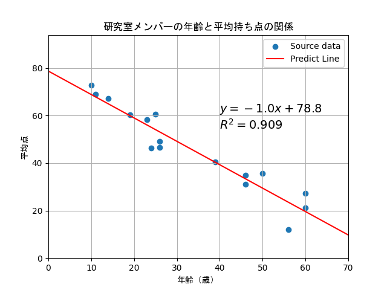

> [出題時のScrapbox](https://scrapbox.io/actscape-seminar/%E6%A9%9F%E6%A2%B0%E5%AD%A6%E7%BF%92%E3%82%BC%E3%83%9F_-_2)

# 1. 機械学習帳の復習

- 1.単回帰，2.重回帰の確認問題を解く


# 2. 2次元ベクトルの管理クラス（numpyの使用禁止）

1. 「Vector2D」という名前のクラスを作成する

    - クラスはx, y変数をフィールドに持つ

    - x, yに値を代入するsetVec(self, x, y)メソッドを作成

    - x, yには`int`や`float`のような普通の数字をそれぞれ与える

1. 作成したクラスをオブジェクトとして宣言し，setVec()によって値を代入した後にフィールドの中身を表示する

1. 以下のメソッドをVector2Dクラスに実装する

    1. ベクトルの大きさを返すgetAbs(self)

    1. 正規化(=ベクトルの大きさを１に)したx, yを返すgetNormVec(self)

    1. 別のベクトル(`[0, 1]`のような形式)を引数に取り，足し算をした結果を返すaddVec(self, otherVec)

    1. 別のベクトルを引数に取り，引き算をした結果を返すsubVec(self, otherVec)

    1. 別のベクトルを引数に取り，内積を計算した結果を返すinnerProd(self, otherVec)


# 3. 統計ファイルをオブジェクト指向で処理する

統計ファイルは`dataset.csv`として格納されている

今回はプログラミングの練習ということで，ライブラリは使用せずに以下の設問を実装すること

1. CSVファイルを読み込む

    - ライブラリを使用せずにファイルの読み込みを行う

    - 一般的にファイルを一行ずつ読み込んでいく手法は以下の通り

        ```python
        path = #CSVのパス文字列#
        with open(path, 'r') as f:
            for line in f.readlines():
                print(line) # ここに一行ずつデータを取り出してやりたい処理を書く
        ```

1. それぞれのレコードを処理するPersonクラスを作成する

    - firstName, lastName, age, sex, results 変数をフィールドとして持つ

    - **コンストラクタ**でそれぞれの値を引数として受け取り、フィールドに代入する

        - コンストラクタとは，クラスの宣言と同時に処理したい事柄を実装できる特殊なメソッドのこと

        - Pythonではメソッド名を`def __init__(self):`として実装することでコンストラクタにすることができる

        - コンストラクタの宣言で`def __init__(self, arg1, arg2)`のように引数を増やすと，クラスを宣言する時に`MyClass(arg1, arg2)`のように引数を与えることができる

1. 作成したPersonクラスを読み込んだCSVのそれぞれのレコードに適用し，Personクラスをリストを作成する

1. Personクラスのフィールドを用いて格納されたデータを１文で表示するshow()メソッドを実装する

    - 今回はshow()メソッドを実行することで中身のデータを読めるようにしているが，Personクラスをprintしただけで中身を確認できるようにすることもできる

    - printに対応した処理を実装するためには[特殊メソッド__str__(self)](https://techacademy.jp/magazine/20615)を実装する必要がある

    - show()で作成した内容を返すように`__str__(self)`を実装すれば，Personクラスをprintするだけで中身を閲覧することができる

1. 以下のメソッドを実装する

    1. フルネームを表示するfullName()
    
    1. 「（姓）は（男 or 女）です」と表示するcheckSex()
    
    1. その人が受けたテストの平均点を得るgetAve()
    
    1. Personオブジェクトを引数に取り、年齢を比較するcompAge(person)
    
    1. resultsに値を追加するaddResult()
        
        - 追加する数字は標準入力
        
        - 入力が不正（数字ではなかったなど）の場合は不正の理由に適したメッセージを出し、再度入力を求める

1. CSVのパスを引数に受け，読み込んだCSVの情報に基づくPersonオブジェクトのリストを返す関数を実装せよ

1. CSVのパスとPersonオブジェクトのリストを引数に受け，リストの情報をCSVに書き出す関数を実装せよ

1. Personオブジェクトのリスト`persons`を引数に取り、次の図を作成するdraw(persons)

    - 横軸にAge，縦軸に各Personのresultsの平均点を取る散布図

    - 単回帰によって得られる直線と決定係数を明記

    - その他の体裁については以下の図を参照

        